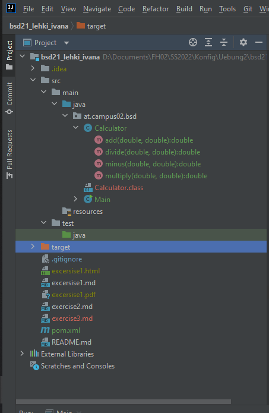
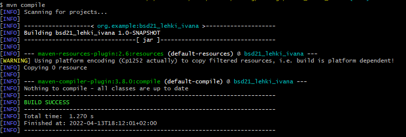
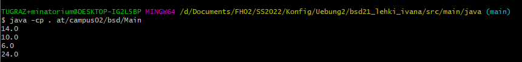

# Assignement 3: Maeven (Java)

### After downloading Maven and updating JDK to verison 17, I created a new Maven Project in IntelliJ. Within the new Project called **"bsd21_lehki_ivana"**, I created two new classes: 
* #### Calculator.java
  ##### This Class contains all of the necessesary Methods.
* #### Main.java
  ##### This Class contains the main Method which executes the Methods of the Calculator Class.

#### Both classese have been added to the at.campus02.bsd package.

#### After creating the maven project in IntelliJ, the pom.xml file has also been created. To the file I added few lines from the Assignment sheet.

### I ran the programm and in IntelliJ, there were some new folders visible, that were not there before I ran the programm.
### 
#### New files that have been created are the *test* and the *target* file, aswell as folder management in the _**src**_ file with *main* and *test* as subfolders, which is also due to the packaging of code (all of the created folders are in the src folder).

#### At the end I compiled it using the _**mvn compile**_ and startet the main class to the run the programm:
* #### after compiling with _mvn compile_:  
* #### after running the programm: 