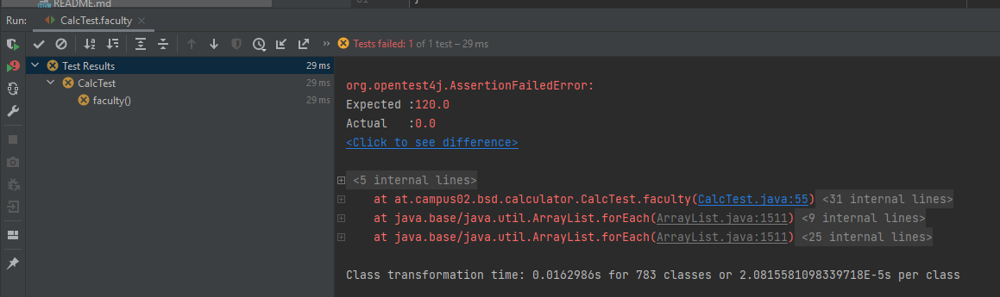

# Exercise 4: Source Code Testing

### In this Exercise I have written JUnit Test for the implementes Methods in the Calculator Class.

### Each Method was tested with 2 different types of test approach:
    * once with the prepared result
    * once with the output from the method in the Calcultor class

## Coverage
### Tests have passed with the Coverage of 100%
## 

### Faculty
#### While creating a method that calculates faculty of a given number, the first assignment was to leave the method empty and make it always return 0. 
#### For the method, another test was written which failed, because the method was not implementef and it always returned 0.
## 

#### After getting a failed test, the method was succesfully implemented and all testcases have passed.
